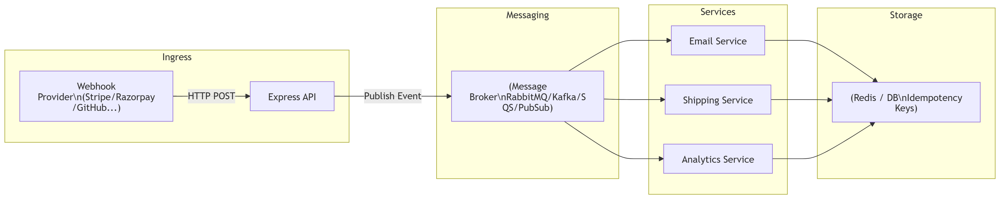

# 📨 Message Brokers — Concepts, Architecture, and Node.js Examples

A **message broker** is a system responsible for moving messages between different services or applications **reliably** and **asynchronously**. It enables **loose coupling**, **fault tolerance**, and **scalability** across microservices and event-driven systems.

Think of it like a **post office for software**:

- ✔ Services **send** messages to the broker  
- ✔ The broker **stores/queues** them  
- ✔ Other services **receive/process** them  
- ✔ If a consumer is slow or offline → **messages wait safely**

---

## 📚 Table of Contents

1. [Core Features](#-core-features)
2. [Architecture Diagrams](#-architecture-diagrams)
3. [RabbitMQ vs Kafka](#-rabbitmq-vs-kafka)
4. [Node.js Implementations](#-nodejs-implementations)
   - [RabbitMQ (amqplib)](#rabbitmq-amqplib)
   - [Kafka (kafkajs)](#kafka-kafkajs)
5. [Idempotence with Message Brokers](#-idempotence-with-message-brokers)
6. [Best Practices](#-best-practices)
7. [Troubleshooting](#-troubleshooting)
8. [Further Reading](#-further-reading)

---

## 🎯 Core Features

| Feature | Meaning |
|--------|---------|
| **Queues** | Store messages until processed |
| **Publish/Subscribe** | Producers publish events; consumers subscribe to topics |
| **Reliability** | Messages won’t be lost even if services fail |
| **Decoupling** | Services don’t directly call each other |
| **Scalability** | Add more consumers to handle more load |
| **Retry + Dead Letter Queues (DLQ)** | Failed messages go to a special queue for inspection/reprocessing |

---

## 🧭 Architecture Diagrams

> These diagrams use **Mermaid**. GitHub, GitLab, and many editors (VS Code with Markdown Preview Mermaid Support) render them automatically.

### 1) High‑Level Event Flow (Webhook → Broker → Consumers)

```mermaid
sequenceDiagram
    participant Provider as Webhook Provider
    participant API as Express API
    participant Broker as Message Broker (RabbitMQ/Kafka)
    participant C1 as Consumer: Email
    participant C2 as Consumer: Shipping
    participant C3 as Consumer: Analytics

    Provider->>API: POST /webhook (JSON)
    API->>Broker: Publish event (e.g., order_placed)
    API-->>Provider: 200 OK (immediate ack)

    Broker-->>C1: Deliver event
    Broker-->>C2: Deliver event
    Broker-->>C3: Deliver event

    C1->>Broker: Ack (processed)
    C2->>Broker: Ack (processed)
    C3->>Broker: Ack (processed)


    